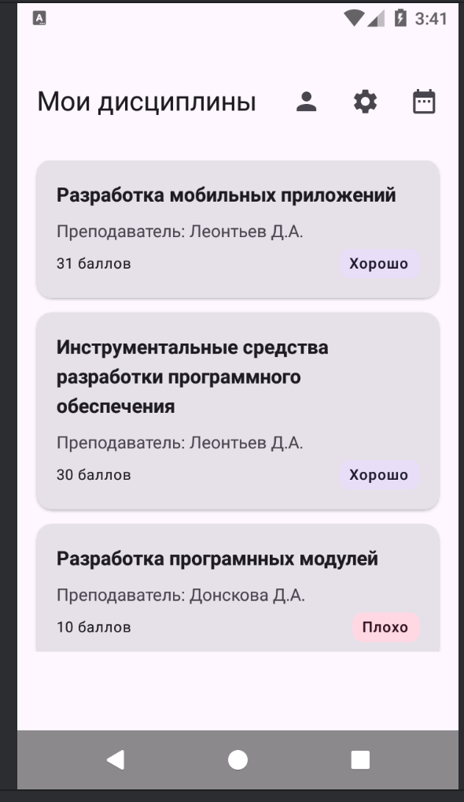
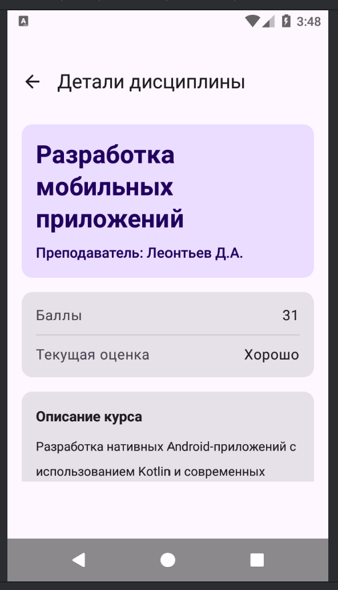
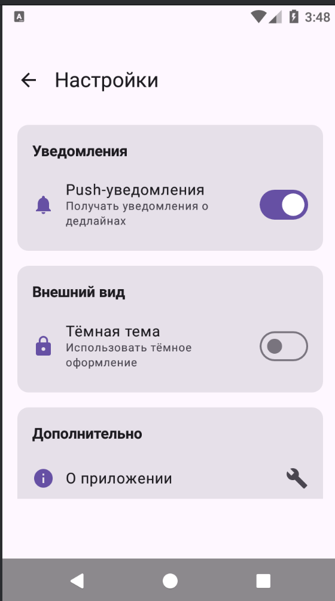
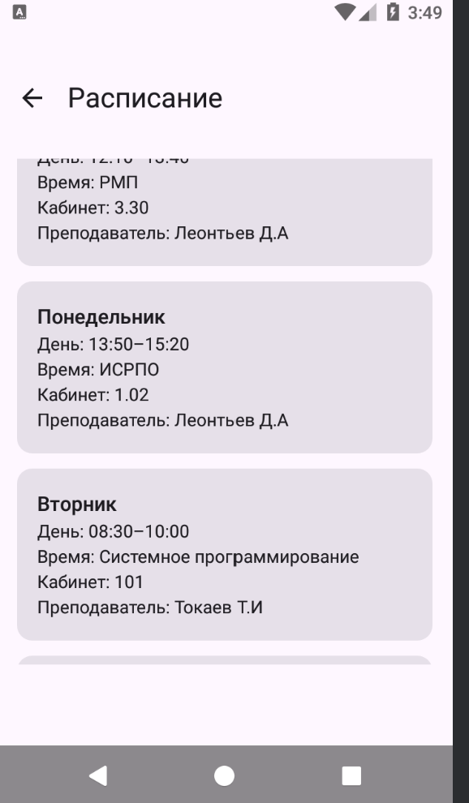
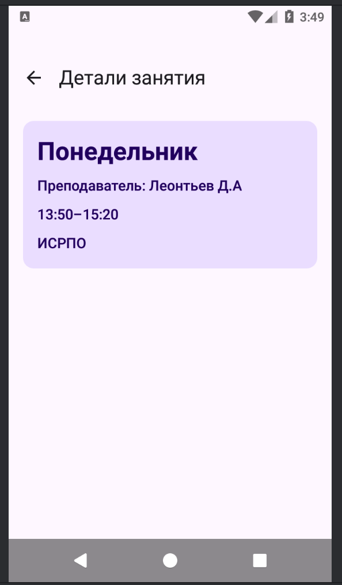

# Student_Planner

Это предложение позволяет студенту отслеживатаь свой прогресс в дисциплинах, просматривать список дисциплин, баллы по ним и всю информацию

## Список экранов 

- Главный экран
- Детальный экран каждой дисциплины
- Профиль
- Настройки
- Расписание
- детальное расписание

## Технологии

- Kotlin
- Jetpack Compose
- Navigation Compose

## Схема навигации 

- Главный экран
  - детали предмета -> На главную
  - настройки-> На главную
  - профиль-> На главную
  - расписание-> На главную
    - детали предмета в расписании -> В расписание

## Скриншоты экранов

## Контрольные вопросы

1) Это объект который управляет навигацией между экранами. Его важно создавать через remember потому что компос может пересоздать ui и навигация будет ломаться
2) Передать параметр в маршрут навигации можно определим машрут, добавить аргумент в навграф, передать параметр 
    1) без обязательного параметра маршрут не сработает
3) Это класс который делает маршруты чистыми
    1) он собирает все маршруты в одном месте, удобно использовать, все машруты видны
4) Это список экранов где был пользователь
   1) Home -> Profile -> Settings(Голова)
   2) Settings удалится из списка и вернется на профиль
5) Это первый экран при запуске
   1) Тот который первый указан
   2) Вроде да
6) Будет ошибка выполнения
   1) Приложение может упасть
   2) юзать sealed class
7) Не дает создать дубликат экрана если он в голове
   1) если нажать на настройки кучу раз то придется вручную закрывать потом их
   2) Если экран в голове то новый не создается

## Авторы

Кузнецов АО Вахрушева АП ИСП-233